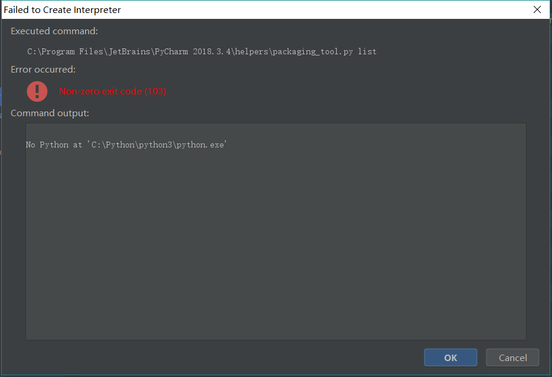

# ipyframework
interface test framework based on python, robotframework, pycharm.

执行脚本：
```shell
robot -P Lib\ -V Env\envirment.py Robot\example\get_example.robot -d Result
```

# 目录介绍
```
ipyframeqork  
├─Env                 # 环境相关配置  
│  └─environment.py  
├─Lib                 # 自定义关键字文件夹  
│  ├─CommonKeywords   # 常用关键字  
│  ├─DataHandler      # 数据处理脚本  
│  └─Utils            # 公用方法及脚本  
├─Resource            # 资源文件夹  
│  └─imge             # 图片资源文件夹  
├─Robot               # 测试用例文件夹  
│  └─example          # 示例测试用例  
│      └─results      # 示例测试用例执行结果目录  
└─Scripts             # 常用脚本归档
```

# 环境安装问题
## 环境搭建
### 1. pycharm安装
#### 1.1 插件安装
##### 1.1.1 安装IntelliBot
##### 1.1.2 安装Robot Frameworke Support
### 2. python3安装
## 自动生成requirements.txt文件  
生成requirements.txt文件  
```python
pip freeze > requirements.txt
```  
安装requirements.txt依赖
```python
pip install -r requirements.txt
```

## 安装virtualenv环境  
**现象：**    
通过pycharm，File->Settings->Project Interpreter添加Virtualenv Environment时，会有报错如下：
  
**原因：**  
由于一台电脑同时安装有python3和python2版本时，在pycharm上安装virtualenv环境。而且在配置python3和python2环境时，个人重命名了python.exe。
及本地python3路径为：C:\python\python3\python3.exe，python2路径为：C:\python\python2\python2.exe。从python报出的异常可以
知道无法定位到python3的可执行文件。  
**解决方案：**  
使用命令安装，首先安装virtualenv。  
```shell
pip3 install virtualenv
```

```shell
virtualenv -p C:\Python\python3\python3.exe D:\github\ipyframework\venv
```
查看，venv文件下即为创建的virtualenv环境目录。


```shell
# 启动虚拟环境
your_env_dir\Scripts\activate      # Windows环境  
source your_env_dir\bin\activate   # Linux环境

# 关闭虚拟环境
your_env_dir\Scripts\deactivate      # Windows环境  
source your_env_dir\bin\deactivate   # Linux环境
```


